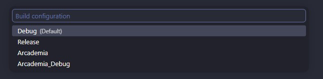

# Arcademia Raylib Template

This is a template used for building Arcademia games using [raylib-cpp](https://github.com/RobLoach/raylib-cpp). 

This template provides minimal boilerplate for getting a game started in raylib, including an automatic build pipeline which fetches raylib automatically, input handling, and a basic scene system which may provide some familiary to developers migrating from Unity, Godot or Unreal Engine.

This template has been designed and tested on both Windows and Linux.

## Getting Started

This project was built to work seamlessly with [VSCode](https://code.visualstudio.com/) and [Cmake](https://cmake.org/), please ensure you have both installed before working with this template.

### Running the Project

A VSCode build task has been defined within this project which handles running CMake build commands and running your game. Using `CTRL + SHIFT + B` will allow you access a build menu with 4 options.



Each of these build types expose a different set of compiler flags which can be used within your project to alter how the game runs. They will be explained in more detail later but they are as follows:

- **Debug:** DEBUG
- **Release:** RELEASE
- **Arcademia:** ARCADEMIA, RELEASE
- **Arcademia_Debug:** ARCADEMIA, DEBUG

*NOTE:* The first time running this project may take a few minutes depending on your internet connection, as CMake must pull raylib from source.

## Features

### Compiler Flags

There are three compiler flags made available by this template for you to use:

- **Debug:** Indicates the project is being tested on.
- **Release:** The project is on a release platform available to the public.
- **Arcademia:** The project is being run on the arcade machines.

These compiler flags should be used to make environment-specific code, such as the following examples:

```cpp
#ifdef DEBUG

DrawFPS(20, 20); // Draw FPS to the screen while testing

#endif
```

```cpp
#if ARCADEMIA

window.SetSize(raylib::Vector2(1920, 1080)); // Arcademia machines require a fullscreen 1080p window
window.ToggleFullscreen();

#endif
```

### Keybinds

This project already comes with all the Arcademia Keybinds mapped to constants in `keybinds.h`.

```cpp

// ==================================================
// PLAYER ONE
// ==================================================

// Joystick
inline constexpr Keybind P1_JOYSTICK_UP    = {KEY_UP, "P1 Joystick UP"};
inline constexpr Keybind P1_JOYSTICK_DOWN  = {KEY_DOWN, "P1 Joystick UP"};
inline constexpr Keybind P1_JOYSTICK_LEFT  = {KEY_LEFT, "P1 Joystick UP"};
inline constexpr Keybind P1_JOYSTICK_RIGHT = {KEY_RIGHT, "P1 Joystick UP"};

// Buttons
inline constexpr Keybind P1_A = {KEY_Z, "P1 A"};
inline constexpr Keybind P1_B = {KEY_X, "P1 B"};
inline constexpr Keybind P1_C = {KEY_C, "P1 C"};
inline constexpr Keybind P1_D = {KEY_V, "P1 D"};
inline constexpr Keybind P1_E = {KEY_B, "P1 E"};
inline constexpr Keybind P1_F = {KEY_N, "P1 F"};

// Misc
inline constexpr Keybind P1_START = {KEY_ENTER, "P1 Start"};
inline constexpr Keybind P1_EXIT  = {KEY_ESC, "P1 Exit"};

// ==================================================
// PLAYER TWO
// ==================================================

// Joystick
inline constexpr Keybind P2_JOYSTICK_UP    = {KEY_W, "P2 Joystick UP"};
inline constexpr Keybind P2_JOYSTICK_DOWN  = {KEY_A, "P2 Joystick UP"};
inline constexpr Keybind P2_JOYSTICK_LEFT  = {KEY_S, "P2 Joystick UP"};
inline constexpr Keybind P2_JOYSTICK_RIGHT = {KEY_D, "P2 Joystick UP"};

// Buttons
inline constexpr Keybind P2_A = {KEY_F, "P2 A"};
inline constexpr Keybind P2_B = {KEY_G, "P2 B"};
inline constexpr Keybind P2_C = {KEY_H, "P2 C"};
inline constexpr Keybind P2_D = {KEY_J, "P2 D"};
inline constexpr Keybind P2_E = {KEY_K, "P2 E"};
inline constexpr Keybind P2_F = {KEY_L, "P2 F"};

// Misc
inline constexpr Keybind P2_START = {KEY_BACKSPACE, "P2 Start"};
inline constexpr Keybind P2_EXIT  = {KEY_Q, "P2 Exit"};
```

If you are developing a pure Arcademia Game, then you can make use of these definitions within our script like :

```cpp
if (IsKeyPressed(P1_START.key))
{
    // Start the Game...
}
```

However if you are making a game for both Desktop and Arcademia, it may be preferrable to create a **Keybind Layout**:

```cpp
struct ExampleKeybinds {
  Keybind moveLeft;
  Keybind moveRight;
  Keybind moveUp;
  Keybind moveDown;
  Keybind primary;
  Keybind secondary;
};

#ifdef ARCADEMIA

// =================================================
// ARCADEMIA BINDS
// =================================================

inline constexpr ExampleKeybinds KEYBINDS = {
    .moveLeft  = P1_JOYSTICK_UP,
    .moveRight = P1_JOYSTICK_DOWN,
    .moveUp    = P1_JOYSTICK_LEFT,
    .moveDown  = P1_JOYSTICK_RIGHT,
    .primary   = P1_A,
    .secondary = P1_B
};

#else

// =================================================
// DESKTOP BINDS
// =================================================

inline constexpr ExampleKeybinds KEYBINDS = {
    .moveLeft  = {KEY_A, "A"},
    .moveRight = {KEY_D, "D"},
    .moveUp    = {KEY_W, "W"},
    .moveDown  = {KEY_S, "S"},
    .primary   = {KEY_ENTER, "Enter"},
    .secondary = {KEY_RIGHT_SHIFT, "Shift"}
};

#endif

DrawText(TextFormat("Press %s to Play!", KEYBINDS.primary.string), 20, 20, 20, WHITE);

if (IsKeyPressed(KEYBINDS.primary.key))
{
    // Start the Game...
}

```

### Resources

The `resources/` folder is where you should store all of your game's runtime assets, such as textures and audio. This folder is automatically copied into your build folder at compile time.

### Scene System

This template includes a boilerplate scene system for ease of migration for Unity, Godot or Unreal Engine developers. This is done through a base Scene class which other scenes can inherit from.

``` cpp
class Scene {
public:
  Scene()          = default;
  virtual ~Scene() = default;

  virtual void Update() = 0;
  virtual void Draw()   = 0;
};

class MainMenu : public Scene {
public:
  MainMenu();
  ~MainMenu(void);

  void Update() override;
  void Draw() override;

private:
  bool acceptPressed = false;
  enum class MenuOption { Play, Quit };
  MenuOption selectedOption = MenuOption::Play;
  raylib::Texture arcademiaTex;
};

class PlayScene : public Scene {
public:
  PlayScene();
  ~PlayScene(void);

  void Update() override;
  void Draw() override;
};
```

#### Scene Functions
Four functions make up a scene:
+ The Constructor
+ The Destructor
+ Update
+ Draw

The natural lifespan of a Scene is to initialize and load all required resources in the constructor, perform update and draw calls while it's loaded, and then safely unload resources in the destructor.

```cpp
MainMenu::MainMenu() {
  // Load Arcademia Logo
  arcademiaTex = raylib::Texture("resources/Arcademia_Logo.png");
}

MainMenu::~MainMenu(void) {
  // Unload Arcademia Logo
  arcademiaTex.Unload();
}


void MainMenu::Draw() {
  ClearBackground(BLACK);

  // Draw Arcademia Logo
  arcademiaTex.Draw(200, 200, WHITE);
}
```


#### Changing Scene

The currently active scene can be changed with the following line of code:

```cpp
sceneManager.SetScene(std::make_unique<Scene>());
```

### Debug Console

The template comes with a debug console that can be accessed at anytime in a *DEBUG* build by using the backtick (`) key. The debug console allows you to output logs, warnings and errors to an in-game display, more importantly, it allows you to input custom commands to quickly alter the flow of the game at run-time. While the console is active, SceneManager will stop running Update() calls, though will still call Draw().

The console comes preloaded with a single command "ls" which can be used to load scenes. The scenes available to this command can be defined within SceneManager.hpp.

#### Accessing Console When Writing Code

The console can be accessed using a singleton 

```cpp
Console::Get()
```


#### Command Definition

```cpp
Player::Player() {
  // Set players max health on construction
  health = maxHealth;

  // Define command
  Console::Get().RegisterCommand(
    "full_heal",
    [this](const std::vector<std::string> &args) {
      // Example - full healing the player (you cheater)
      this->health = maxHealth;
    }
  )
}
```

*Note: Attempting to register a second command under the same name is not allowed and will throw an error. Please ensure that commands are properly unregisterd when an object is freed*

```cpp
Player::~Player() {
  Console::Get().UnregisterCommand("full_heal")
}
```

#### Logging to Console

The console has three different functions for printing to the console at three different levels:

```cpp
void Log(const std::string &message);    // Logs in RAYWHITE
void Warn(const std::string &message);   // Logs in GOLD
void Error(const std::string &message);  // Logs in RED
```

Functionally, these are no different from another apart from the colour the message gets rendered in.